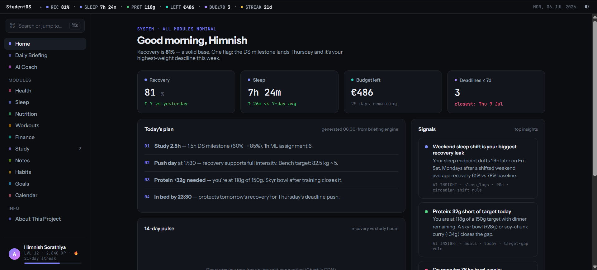
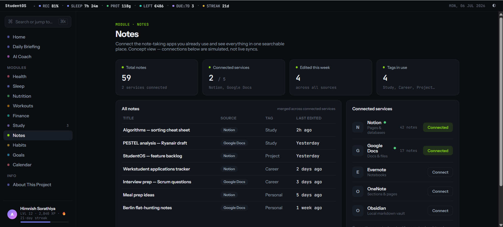
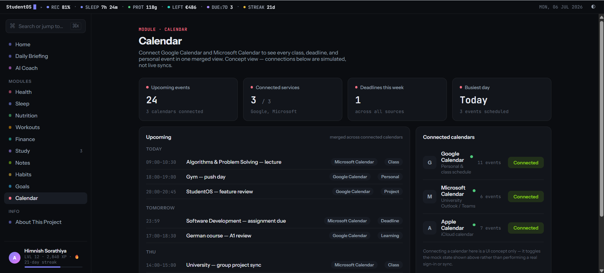

# StudentOS

> A concept dashboard exploring what it would look like to unify academics, health, finance, and productivity into one student life operating system.

An AI-assisted concept product — not a production application — built to explore product thinking, information architecture, and dashboard UX.

🌐 **Live Demo:** https://himnishahir05.github.io/StudentOS/

---

## Overview

StudentOS is a concept prototype exploring what a unified student dashboard could look like — bringing academics, health, sleep, workouts, nutrition, finance, study, habits, goals, notes, and calendars into a single interface instead of a dozen disconnected apps.

This is intentionally a concept-stage project focused on validating product ideas, UX, and information architecture — not a finished, production-ready application.

## The Problem

Students juggle a separate app for almost everything: calendar, notes, study planner, budget tracker, sleep tracker, fitness tracker, habit tracker. These tools rarely talk to each other, so connections get missed — a late Saturday night quietly costs Monday's study session, a tight week of deadlines quietly tanks recovery and workout quality. StudentOS explores what changes when these systems share one view.

## Solution

Instead of another single-purpose tracker, StudentOS acts as a unified interface where a student can see how the different parts of their week actually connect, with a daily briefing and cross-module insights pulling the pieces together.

## Screenshots

| Home Dashboard | Notes | Calendar |
|---|---|---|
|  |  |  |

## Current Features

**Dashboard** — unified overview, daily metrics, cross-module summaries, quick actions
**Daily Briefing** — a generated daily report combining study priorities, recovery, workouts, nutrition, and budget into one recommendation set
**AI Coach** — a prototype conversational interface (see *Current Limitations* below — responses are pattern-matched, not a live model)
**Health** — weight, body composition, BMI, hydration, trend analysis
**Sleep** — duration, recovery, HRV, resting heart rate, sleep debt
**Nutrition** — calories, protein, macros, daily targets
**Workouts** — training history, PRs, volume tracking
**Finance** — budget tracking, spending categories, cash flow
**Study** — courses, assignments, deadlines, Pomodoro tracking
**Notes** — concept integrations for Notion, Google Docs, Evernote, OneNote, Obsidian
**Calendar** — concept integrations for Google Calendar, Microsoft Calendar, Apple Calendar
**Habits** — streaks, heatmaps, consistency tracking
**Goals** — long-term progress across fitness, learning, career, and finance

## Design Highlights

Command palette (⌘K) · dark/light mode · modular dashboard architecture · system status bar · cross-module insight cards · consistent visual language

## Technologies

HTML5, CSS3, JavaScript, Chart.js, Google Fonts, Claude Code (AI-assisted development)

## My Role

I identified the problem, defined the product vision, designed the information architecture, and made every UX and interaction design decision — the command palette, the daily briefing format, the module structure, and the visual hierarchy. I directed the build using Claude Code (AI-assisted development): prompting, reviewing, and iterating on the implementation through multiple rounds. I did not hand-write the underlying code.

## Current Status: Concept Prototype

This is intentionally a concept-stage prototype, not a production app. Current limitations:

- No backend, authentication, or cloud database
- No real API integrations — Notes and Calendar "connections" are simulated toggles, not live OAuth sync
- No live AI model — the AI Coach matches input against prewritten response patterns
- No wearable synchronization
- Mock data throughout
- No formal user testing has been run yet — the next real step before calling any UX decision validated rather than reasoned-through

These constraints are intentional and let the concept iterate quickly before any real engineering investment.

## Roadmap

Near-term, in priority order:

1. Run 5–8 short user interviews with other students to test whether the module set and daily briefing actually match how people think about their day
2. Add a real calendar integration (Google Calendar API) as the first real (non-mock) connection
3. Explore whether the AI Coach is worth wiring to a real model, based on what interviews turn up

Longer-term ideas (unvalidated): wearable data, a lightweight mobile view, and a version of the "one dashboard" idea that isn't student-specific. These are directions, not commitments — validation comes first.

## Skills Demonstrated

**Product:** product thinking, product strategy, feature prioritization, roadmapping
**UX:** information architecture, dashboard design, interaction design, user-centered design
**Business:** systems thinking, problem solving, analytical thinking
**Technical:** HTML5, CSS3, JavaScript, Chart.js, responsive design, AI-assisted development

## License

MIT — see [LICENSE](LICENSE). Free to view, learn from, and reuse with credit.

## Feedback

StudentOS is an evolving concept — feedback and ideas are welcome via Issues.

## Author

**Himnish Sorathiya**
📍 Berlin, Germany
GitHub: https://github.com/himnishahir05
LinkedIn: https://www.linkedin.com/in/himnish-sorathiya-9a384b306

---

⭐ If you found this interesting, consider starring the repo.
